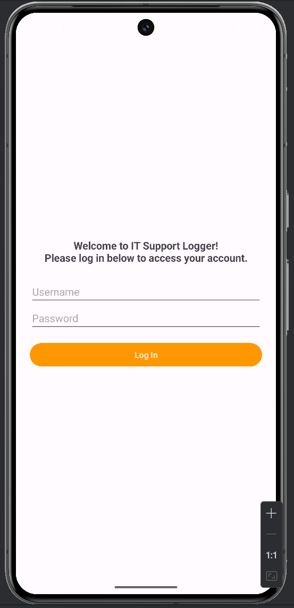
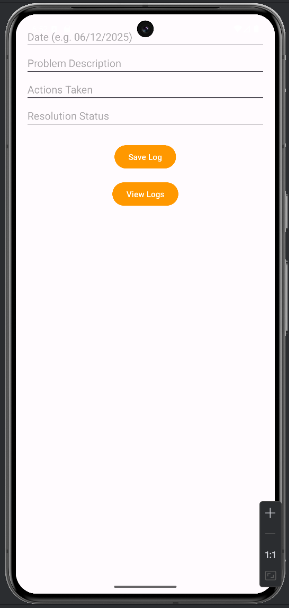
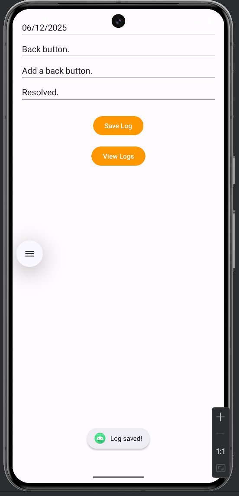
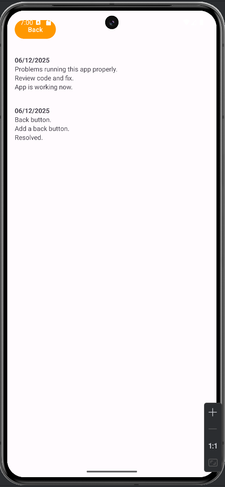

# 🛠️ IT Support Logger App

The **IT Support Logger App** is an Android-based tool that allows IT support personnel to log and track issues quickly and locally on their devices. This project demonstrates how to build a functional, user-friendly app using Java, SQLite, and Android Studio.

---

## ✨ Features

- 🔐 **Login Authentication** – Users must log in with a username and password.
- 📝 **Record Logs** – Track support issues with date, problem description, actions taken, and resolution status.
- 📄 **View Logs** – All saved logs are displayed in a scrollable, user-specific list using RecyclerView.
- 🧠 **User-Friendly UI** – Simple, clear layout for real-world usability.
- 💾 **SQLite Database** – Stores logs per user account locally.

---

## 🚀 Screenshots

### 🔐 Login Screen


---

### 📝 Record Log (Empty Form)


---

### ✅ Record Log (Filled Out & Saved)


---

### 📄 View Logs


---

## 📦 How to Use

1. Clone this repository:
   ```bash
   git clone https://github.com/mcphammer/IT-Support-Logger-App.git
